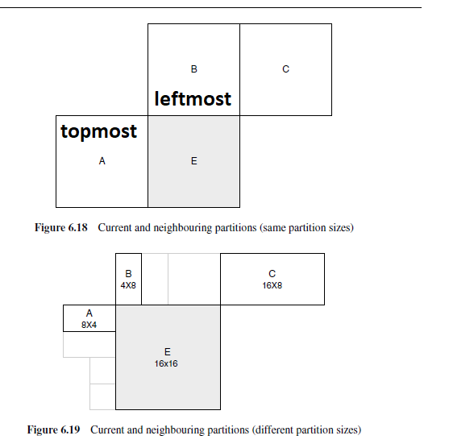

PKG_CONFIG_PATH="/usr/local/ffmpeg/lib/pkgconfig" ./configure --enable-nonfree --enable-cuda-nvcc --enable-libnpp --extra-cflags=-I/usr/local/ffmpeg/include --extra-ldflags=-L/usr/local/ffmpeg/lib --disable-static --enable-shared --enable-nvenc --enable-cuvid --enable-libnpp --enable-gpl --enable-libx264 --enable-shared --disable-static --enable-libx265  --enable-libaom
конфигурация с которой все работает. если не установлена куда то вырезать libnpp, nvcc, cuvid


duration small-bunny -- 2.01m = 121s
duration b264t_half -- 28m:26.47s = 1706.5

возникла проблема с открытием файла когда выполнил sudo apt install -y  libavcodec-dev  libavformat-dev  libavutil-dev  libswscale-dev


# что происходит?
1. чек argc
2. malloc для formatContext
3. открытие стрима для формата (ffprobe?)
4. поиск инфы стрима
5. foreach stream
    - codecparams = context.streams[i].codecpar(ameters)
    - avcodec_find_decoder
    - if codectype = video_type  and video stream index == -1 {set codec, codecparams, video stream index=!-1} 
6. malloc для codecContext
7. передача параметров в контекст
8. открыть кодек
9. malloc для frame
10. malloc для пакета
11. while (can_read_frame)
    - if packet.stream_index = video_stream_index
        - avcodec_send_packet
        - while avcodec_receive_frame
            - null
    - av_packet_unref


имеет смысл оптимизировать:
1. avcodec_send_packet
2. av_read_frame
3. av_packet_unref
4. avcodec_receive_frame

c av_packet_unref (результаты с другого такого же бенча) для b264t_half
```  
% time     seconds  usecs/call     calls      function
------ ----------- ----------- --------- --------------------
 60.88   39.686826         775     51143 avcodec_send_packet
 15.04    9.805516          74    131135 av_read_frame
 12.78    8.328330          63    131134 av_packet_unref
 10.36    6.753832          66    102286 avcodec_receive_frame
  0.89    0.579211          30     18783 SYS_read
  0.01    0.007988        7988         1 avformat_find_stream_info
  0.01    0.005006        5006         1 avformat_open_input
...
------ ----------- ----------- --------- --------------------
100.00   65.188671                434851 total
```
без c av_packet_unref -- ~-12%
```
% time     seconds  usecs/call     calls      function
------ ----------- ----------- --------- --------------------
 68.66   39.649072         775     51143 avcodec_send_packet
 18.11   10.460121          79    131135 av_read_frame
 11.85    6.842599          66    102286 avcodec_receive_frame
  1.09    0.631828          33     18783 SYS_read
  0.23    0.133065          28      4685 SYS_brk
  0.01    0.007196        7196         1 avformat_find_stream_info
  0.01    0.005311        5311         1 avformat_open_input
...
------ ----------- ----------- --------- --------------------
100.00   57.747016                308376 total
```


 --disable-safe-bitstream-reader
                           disable buffer boundary checking in bitreaders
                           (faster, but may crash)
флаг в configure libav, очень интересно


# компиляция
sudo apt-get update -qq && sudo apt-get -y install \
  autoconf \
  automake \
  build-essential \
  cmake \
  git-core \
  libass-dev \
  libfreetype6-dev \
  libgnutls28-dev \
  libmp3lame-dev \
  libsdl2-dev \
  libtool \
  libva-dev \
  libvdpau-dev \
  libvorbis-dev \
  libxcb1-dev \
  libxcb-shm0-dev \
  libxcb-xfixes0-dev \
  meson \
  ninja-build \
  pkg-config \
  texinfo \
  wget \
  yasm \
  zlib1g-dev

sudo apt-get install libx264-dev

билдим не libav, а ffmpeg

наш декодер это ffmpeg/libavcodec/h264dec.c/ff_h264_decoder

1. avcodec_send_packet(avcodeccontext, avpacket) -- результат декодированного avpacket пишется в avcodeccontext
2. decode_receive_frame_internal(avcodeccontext, ((DecodeContext *)avpacket).buffer_frame ) -- buffer_frame is AVFrame
  - ff_decode_receive_frame_internal || ff_thread_receive_frame ( ((DecodeContext *) avcodeccontext).internal, ((DecodeContext *)avpacket).buffer_frame)
  - decode_simple_receive_frame(AVCodecContext *avctx, AVFrame *frame) -> decode_simple_internal
  - decode_simple_internal -> cb.decode; cb is codec.cb; h264.cb.decode = h264_decode_frame
    - h264_decode_frame:
    - buf -- AVPacket.data
    - buf_size == 0?return output(is buf):null
    - av_packet_get_side_data!=false?int[] side = av_packet_get_side_data; ff_h264_decode_extradata(side)
    - h.is_avc & buf_size>8 & ... {if is_avc_extradata(buf){return ff_h264_decode_extradata(buf)}}
    - buf_index = decode_nal_units(buf)
    - if h.cur_pic_ptr=null & h.nal_type = end of sequence {return send_next_delayed_frame}
    - if h264ctx.mb_y >= h264ctx.mb_height & h264ctx.mb_height!+null{
        ret = ff_h264_field_end; if ret<0 return ret
        if h.next_output_pic!=null{ret=finalize_frame; if ret<0 return ret}
        }
    - ff_h264_unref_picture

судя по всему инфа о слайсах и макроблоках находится в h264context
**возможно** макроблоки обрабатываются в ff_h264_decode_extradata либо в decode_nal_units

после билда ./configure --enable-nonfree --enable-cuda-nvcc --enable-libnpp --extra-cflags=-I/usr/local/cuda/include --extra-ldflags=-L/usr/local/cuda/lib64 --disable-static --enable-shared --enable-nvenc --enable-cuvid --enable-libnpp
```
LOG: releasing all the resources
% time     seconds  usecs/call     calls      function
------ ----------- ----------- --------- --------------------
 55.56  154.047833        3012     51143 avcodec_send_packet
 15.03   41.670321         317    131135 av_read_frame
 12.28   34.047088         259    131134 av_packet_unref
 10.65   29.541607         288    102286 avcodec_receive_frame
  4.96   13.760783         269     51143 snprintf
  1.07    2.963812         157     18788 SYS_read
  0.33    0.909480         375      2419 fwrite
  0.05    0.130142         227       571 SYS_write
------ ----------- ----------- --------- --------------------
100.00  277.263927                489003 total
```

после билда --extra-cflags=-I/usr/local/cuda/include --extra-ldflags=-L/usr/local/cuda/lib64 --enable-shared --enable-nvenc --enable-cuvid
и с 
```c
AVDictionary * codec_options = NULL;
  av_dict_set(&codec_options, "preset", "ultrafast", 0);

  // Initialize the AVCodecContext to use the given AVCodec.
  // https://ffmpeg.org/doxygen/trunk/group__lavc__core.html#ga11f785a188d7d9df71621001465b0f1d
  if (avcodec_open2(pCodecContext, pCodec, &codec_options) < 0)
```
```
% time     seconds  usecs/call     calls      function
------ ----------- ----------- --------- --------------------
 57.20   41.412254         809     51143 avcodec_send_packet
 14.60   10.572910          80    131135 av_read_frame
 12.08    8.748295          66    131134 av_packet_unref
  9.86    7.135124          69    102286 avcodec_receive_frame
  4.82    3.487634          68     51143 snprintf
  1.01    0.731560          38     18788 SYS_read
  0.30    0.213671          88      2419 fwrite
------ ----------- ----------- --------- --------------------
100.00   72.394540                489005 total
```
после билда --extra-cflags=-I/usr/local/cuda/include --extra-ldflags=-L/usr/local/cuda/lib64 --enable-shared --enable-nvenc --enable-cuvid
и с заменой av_packet_get_side_data на lambda args:NULL (чтобы всегда возвращала null)
```
% time     seconds  usecs/call     calls      function
------ ----------- ----------- --------- --------------------
 56.92   41.927824         819     51143 avcodec_send_packet
 14.67   10.809652          82    131135 av_read_frame
 12.24    9.015743          68    131134 av_packet_unref
 10.05    7.405701          72    102286 avcodec_receive_frame
  4.87    3.586441          70     51143 snprintf
  0.87    0.638473          33     18788 SYS_read
  0.29    0.212523          87      2419 fwrite
------ ----------- ----------- --------- --------------------
100.00   73.663037                489005 total
```
эффекта нет

1_extract_macroblocks (пример извлечения макроблоков) ~~в два раза быстрее чем обычный декодинг~~ по времени так же как обычный декодинг, примерно 90с

у нас есть nal.
nal получаем из libav.
затем libav декодирует nal и мы получаем slice.
в slice есть тип -- тип фрейма и он содержит те макроблоки чьи типы совпадают с его типом.
мы фильтруем слайсы по нашему типу, достаем макроблоки.


### посмотреть в сторону AV_FRAME_DATA_CONTENT_LIGHT_LEVEL, AVContentLightMetadata из av_frame_get_side_data

./configure --enable-gpl --enable-shared --enable-libx264 --enable-nonfree


h264_mb.hl_decode_mb_idct_luma -- ~~декодирование макроблоков~~ inverse discrete cosine transform макроблоков
  если это не 4*4 интра но (16*16 интра либо какой-то cbp слайса & 15 = 1)
  добавляет некоторое значение в некоторую координату в H264PredContext(hpc) 
  либо добавляет (4 пикселя? или очищает 4 пикселя?) 16 раз

  входит в
    hl_decode_mb_simple_8
      входит в
        ff_h264_hl_decode_mb
    hl_decode_mb_444_simple_8
      входит в
        ff_h264_hl_decode_mb
h264_mb.hl_decode_mb_predict_luma -- если интра 4*4 и (8x8 discrete cosine transform или нет)

  входит в
    hl_decode_mb_444_simple_8
      входит в
        ff_h264_hl_decode_mb

h264_mb.ff_h264_hl_decode_mb

  входит в h264_slice.decode_slice, h264dec.h264_er_decode_mb

важный момент:
  ((av_alias_16 *)(mb + index))->u16 = value 
  или
  (((av_alias32 *) (((int32_t *) mb) + index))->u32 = (value))


h264_mb_template.c:153-188: это моушион декодинг, без этого output_dc_no_motion

~~в h264_slice.decode_slice 2 фора: фор для cabac и фор для cavlc~~ в h264_slice.decode_slice иф для двух форов, все ок

h264_cavlc:746:// We assume these blocks are very rare so we do not optimize it.

попробуй игнорить mb_type!=3 в cavlc
попробуй закомментить FUNC(hl_motion_420) в h264_MB_TEMPLATE
движение декодится в h264_mb_template:172(hl_motion)->h264_mc_template
h264_mc_template->mc-> 2x std:-5%
b264_half -- cavlc

внутрикадровое предсказание:
hor, vert, dc, plane
межкадровое предсказание (motion compensation):
???

цель: переписать cavlc сугубо под dc

возможная оптимизация: mid_pred?
h264_mvpred.h:323 откомментировал, не заметил изменений

slice->cabac/cavlc; slice->ff_h264_hl_decode_mb

h264_mb_template.c:60-61 -- если prefetch -- jr, то проводятся ненужные 6 вычислений

h264qpel_template -- qpel -- quarter pel -- Quarter-pixel motion

libavutil/common.h -- удалить else

# как воспроизводить сразу 2 видео
To accomplish this simply open VLC and select Media>Open Multiple Files.
Inside the multiple file windows select add to add the first file.
After this click on the, "Show more options," checkbox followed by the, "Play another media synchronously," checkbox at the bottom of the window.
Select browse next to, "Extra media," to add the second file.
Hit play and the two media files will play simultaneously with a single control window.


# qpel
в qpel есть дефолтный сишный код и ассемблер. ассемблер перекрывает сишный код и чтобы заработал сищный код нужно вырезать define с ассемблером под разные платформы в h264qpel.c

бенчи:
stock 40s
extreme qpel (c) 40s
stock no assembly 47.5s 

todo:
printf("something\n") из функций в qpel
python-app считающий кол-во каких-то строк в stdin

регистры:
- rax 64b
- eax 32b
- ax 16b
- ah 8b
- al 8b

qpel x86 asm: h264qpel_init_loongarch.c:ff_put_h264_qpel16_mc00_lsx->h264qpel.S

# mc
1 партиция -- один вектор
партиции:
16x16
2 8x16
2 16x8
4 8x8
при этом 8x8 -- 8x8 | 2 4x8 | 2 8x4 | 4 4x4

часто моушен векторы зависят от соседних так что бывает что вектор (mv_pred) предсказывается от предыдущего/предыдущих векторов. MVD -- дельта текущего и предсказанного вектора, закодирована в видео

выбор предсказания mv_pred:
- для партиций кроме 16x8 8x16
  - медиана mvs для A,B,C
- для 16x8 партиций 
  - mv_pred для верхней 16x8 партиции предсказан от B и mv_predдля нижней 16х8 партиции предсказан от А
- для 8х16 партиций 
  - mv_pred для левой 8x16 предсказан от А и для правой 8х16 от С
- для пропущенных МБ 16x16 вектор сгенерирован как в 1 (вроде)

если >=1 МБ недоступны то выбор векторов соответственно меняется.

CONFIG_GRAY: может быть исправить код чтобы при CONFIG_GRAY использовался только luma?

filter_mb_edgecv filter_mb_edgech -- при закомментировании (return из начала функции) ~~не обнаружено вреда для картинки~~ картинка периодически меняет резкость в чб, при том скорость увеличилась на 5%. убраны edge фильтры для хромы

mc_part_std: при закомментировании dest_cb, dest_cr нет вреда для чб, +2% производительности (339-348)
hl_motion: если закомментировать все кроме 16x16 то еще + 2%

+1% от побитовых оптимизаций fill_decode_caches

ff_h264_add_pixels4: можно попробовать скопировать юнионом

__builtin_expect в интра pcm МИНУС ПРОЦЕНТ
__builtin_expect !is_skip(mb_type) опустил время ниже 39 (38.99)


## профилирование скорости в decode_slice
```
decmb 30.369790 11.552188 20.371902 11.298414
LOG: releasing all the resources
60.16user 72.55system 2:12.72elapsed 99%CPU (0avgtext+0avgdata 23884maxresident)k
1039632inputs+0outputs (0major+3971minor)pagefaults 0swaps
```
расшифровка:
- время ff_h264_decode_mb_cavlc: 30.37
- время decode_slice:2687-2696(if ret>=0&&FRAME_MBAFF(h)): 11.55
- время decode_slice:2707(if ++sl->mb_x>=h->mb_width): 20.37
- время decode_slice:2739(if(get_bits_left&sl->gb<=0&&sl->mb_skip_run<=0)): 11.30

приоритеты: 1,3,2+4

pred_spatial_direct_motion, pred_temp_direct_motion


decode_luma_residual

# важно: RSWGABS может быть платформозависимым. он посчитан для int=32bit

q8hvl: 19876216
q8vl: 42666108
q8hl: 44685544

# важно: не реализован функционал cavlc для cabac

28.01:
скорость h264: 
- ~40 сток ~46 сток с вырезанным ассемблером
- ~39 вырезанный ассемблер + кастом модификации
скорость h265:
- плацебо/ультрафаст 36
- xtreme qpel 86.54 (wtf)
- xtreme qpel только с qpel epel закомментированным ассемблером -- 70.73

вывод: не стоит менять ассемблер на си

h265 qpel
проблема: где-то юзаются значения ff_hevc_qpel_filters кроме 3, 4
решение: в h26x/h2656_inter_template.c


Intel SVT-AV1

libaomdec stock 69.8

h.264: может быть рассмотреть одновременное интра предсказание 4x2 блоками?

__builtin_prefetch -- загружает объекты в кэш процессора

мб кэшировать idct?

https://github.com/cconcolato/av1-spec/blob/master/05.decoding.overview.md
https://arxiv.org/pdf/2008.06091
https://gitlab.com/AOMediaCodec/SVT-AV1/-/blob/master/Docs/README.md

**заметка по libaom_refresh: почему-то работает только если сначала сделать с sudo, потом без sudo**

# давайте думать решать

категории интереса:
к1 значительные потери в элементе = незначительные потери в результате; вырезание
к2 незначительные потери в элементе = незначительные потери в результате; оптимизация, мб вырезание в последнюю очередь
к3 незначительные потери в элементе = значительные потери в результате; только оптимизация
к4 встречается редко


возможности av1:
1. altref
  - оставляем, к3
2. cdef
  - попробуем вырезать/оптимизировать, к1
  - аналог loop filter, но применяется после loop filter и сглаживает края в 8 различных направлениях
3. CfL -- chroma from luma prediction
  - к2
4. Compund mode prediction
  - к2, попробовать заменить compound на обычный метод предсказания
5. loop filter
  - к2 но стоит попробовать в первую очередь
6. global motion
  - слишком комплексно, к2
7. motion
8. intra
9. compliant sub-pel interpolation
  - к1, попробовать extreme qpel
10. film grain sunthesis
  - синтез зернистости, к4
11. ibc intra block copy
  - метод оптимизации, к4
12. local warped motion / LW motion
  - движение + поворот. ***к3***

generic/specific(x86) -- 350с/96с, значит нужно менять симды
надо начать с sse4


вырезанный sse2 loopfilter: 64.156
- вырезанный sse2 loopfilter, sse2 high bit depth loopfilter: 58.666
  ~~- вышеперечисленное + вырезана stage 4-5 в idct8x8_low1_avx2: значительные артефакты, 54.062~~

~~intra_edge_sse4.c -> const int use_3tap_filter = 1: небольшие артефакты, 58.508~~
сток: 65.754

идея для h.264: кэширование интерполяции. взять верхнее горизонтальное значение и использовать его для всех вертикальных 

av1:
- апсемплинг/скейлинг можно переделать длля наших нужд
- dct cutoff (см. dct_cutoff.md)


сток 253.55? почему?
4ed507116d53fe5581f221873dbb398d63a3c1f2 луп фильтры 234.794

half_btf:
(x + 2^(y+1) ) / 2^y -- 294 
c оптимизацией: 332

4.95 не оп | 5.21 оп + коммент

## конфиги
1: 
```
sudo rm -r ./cmake-build-debug/ ;\
cd ../aom_build &&\
sudo rm -rf ./* &&\
PATH="$HOME/bin:$PATH" sudo cmake -G "Unix Makefiles" ../libaom -DAOM_TARGET_CPU=generic -DENABLE_TESTS=OFF -DENABLE_AVX2=OFF -DENABLE_AVX2=OFF -DENABLE_SSE=OFF -DENABLE_SSE2=OFF -DENABLE_SSE3=OFF -DENABLE_SSE4_1=OFF -DENABLE_SSE4_2=OFF -DENABLE_SSSE3=OFF  -DENABLE_NASM=on -DCMAKE_INSTALL_PREFIX="/usr/local" &&\
PATH="$HOME/bin:$PATH" sudo make -j 8 && sudo make -j 8 install && cd ../libaom
```


1. полный сток 247.643 на коммите 3990233fc06a35944d6d33797e63931802122a95 с конфигом 1

2. частично вырезанные loopfilter 235.057 на коммите 4ed507116d53fe5581f221873dbb398d63a3c1f2 с конфигом 1

3. сток + быстрое вычисление half_btf 246.517 с конфигом 1

4. вырезанный loopfilter, мелкие оптимизации, быстрое вычисление 230 half_btf на коммите 1833ea0955159b4bf2e450095e2c63f454c1bb95

5. 4 +cdef  207.957 на коммите d7909ab22a8c9d17c182bb37c3e5d5839791f92c

6. 5 + превычисления в highbd_filter_intra_predictor 205.21 + вычисление 2 блоков вместо 8 на коммите bdc292644187c1e82478667c8bb5d268b1638211

7. 6 + битовые фокусы в highbd_filter_intra_predictor 202.257 на коммите 122e33b92e474e2e8ec13c46d76a7c08c970bc81

8. 7 + filter strength 0, битовые фокусы 201.117 на коммите ...

9. 8 + кастом idct (quarter precision) 190 на коммите d256dcc157c2e8b6f14e487480517df931501fe7

10. 9 + вырезанная интерполяция 75 на коммите 964c0638ad3c16ef6b810c302abdcbb4cf4c667d


# как работает AV_IDCT4?
stage1:
output[0] = input[0]
output[1] = input[2]
output[2] = input[1]
output[3] = input[3]
stage2:
step[0] = cos(pi/4) * output[0] + cos(pi/4) * output[1] // 0 = 0+1
step[1] = cos(pi/4) * output[0] - cos(pi/4) * output[1] // 1 = 0-1
step[2] = cos(3pi/8)* output[2] - cos(pi/8) * output[3] // 2 = 2 - 3
step[3] = cos(pi/8) * output[2] + cos(3pi/8)* output[3] // 3 = ~2 + ~3

дефолт
addfacade: 129.20832850220614
dt: 293.18264890000324
dttaw: 296.482046900001
idctc0: 0.4181916000010978
idctc1: 6.303812601486666
idctc10: 0.19740680000177285
idctc11: 0.003739999999999249
idctc2: 12.129768597276785
idctc3: 6.675519001543221
idctc4: 2.0229569999908077
idctc5: 0.34655700000169254
idctc6: 3.6782331993704696
idctc7: 2.3966551998485546
idctc8: 0.009856400000000362
idctc9: 0.21867920000199254
idctr0: 0.35355940000177477
idctr1: 5.88312460107762
idctr10: 0.24420080000232866
idctr11: 0.0034069999999993467
idctr2: 12.62048839726352
idctr3: 6.5994748014943365
idctr4: 2.516619199935966
idctr5: 0.3352272000020218
idctr6: 3.660566799334332
idctr7: 2.6773143997247404
idctr8: 0.00829980000000269
idctr9: 0.22050860000209788
itac: 134.0049985017071
pib: 131.4170368031762
( make run_hello | python3 timing.py; )  319.78s user 64.08s system 126% cpu 5:04.60 total

посмотреть промахи tlb

попробовать убрать clamp

188.39 рекорд когда заменил все av1_idct на RSWG_EX
